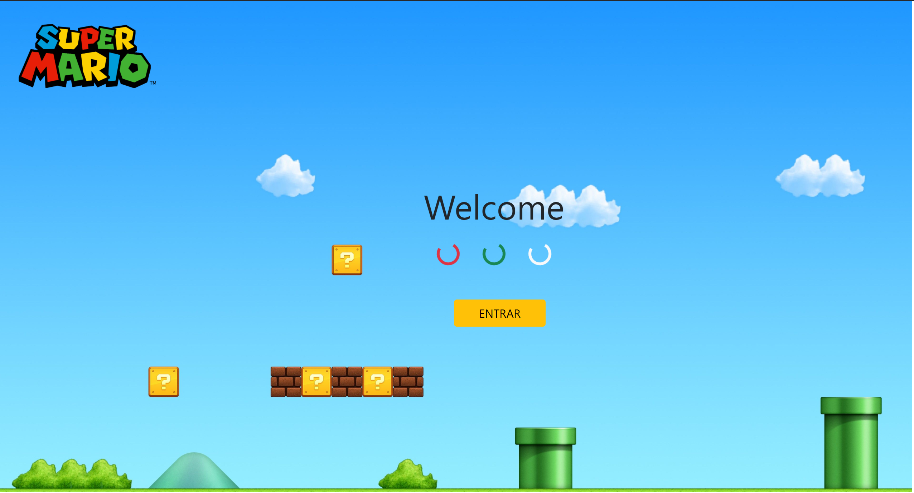

# JUEGO DE LUCHA
Mi primer proyecto basado en un juego de lucha

# Introducción 🚀
La página web, la tengo dividida en 4 pantallas:
- [**Primera**](#item1) - Inicio del juego.
- [**Segunda**](#item2) - Seleccion de jugadores.
- [**Tercera**](#item3) - Campo de batalla.
- [**Cuarta**](#item4) - Estado de cada jugador.

# Construido con 🛠️
El juego de lucha esta realizado con **HTML**, **CSS** y **JAVASCRIPT**.

# Funcionamiento :computer:

| <a name="item1">Pantalla 1</a>   | <a name="item2">Pantalla 2</a> | 
| --------- | --------- |
| Es necesario hacer click en el botón **ENTRAR**. | Tienes que seleccionar a un minimo y maximo de 2 avatares que serán: el 1ro para el player 1 y el 2do para el player2, luego precionar el botón **GO**.|
|  |  |
|
 <a name="item3"><b>Pantalla 3</b></a>
| 
<a name="item4"><b>Pantalla 4</b></a> 
 | 
| Precionar START y comienza un contador, para el player1 (Barra de vida **Rojo**), pulsar la tecla **Q**. Para el Jugador2 (Barra de vida **Amarilla**), pulsar la tecla **P**. | Aqui solo me mostrar si el Ganador gano o perdio, mostrando siempre al ganador del lado **DERECHO** con una estrellita. |
|  |  |

# Licencia 📄

Este proyecto está bajo la Licencia **MIT Licence** - mira el archivo [LICENSE.md](LICENSE.md) para detalles.

[Subir](#top)
